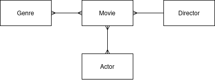

# Filmová databáze GAMDB

*Autor: Václav Chalupníček <vaclav.chalupnicek@gyarab.cz>*

Ukázkový ročníkový projekt z předmětu webové technologie ve šk. roce 2024/2025.

Filmová databáze – GyArab Movie DataBase (GAMDB) – je webová aplikace přístupná na <https://vch.gawt.dtcloud.cz>.

## Odborný článek

V administraci se spravuje databáze filmů, každý film má název, hodnocení, popis, rok premiéry, žánry a obrázek (plakát). Každý film má jednoho režiséra a několik herců.

Na homepage je seznam filmů, který je možné filtrovat (dle žánru) a řadit (dle hodnocení a roku). Seznam filmů tvoří kartičky, na kterých se zobrazuje titulní obrázek filmu, název, žánry a prvních 200 znaků popisu. Kliknutím na kartičku se zobrazí stránka detailu filmu, kde se zobrazují všechny atributy filmu. Z detailu filmu je možné prokliknout žánr (vede na HP s vyfiltrovaným žánrem) nebo režiséra či herce (vede do detailu osoby). Detail osoby zobrazuje Jméno, rok narození, fotografii a popis, dále jsou vylistované filmy, které daná osoba režírovala a ve kterých filmech hrála, přes ty je možné přejít do detailu filmu.

Hlavní menu obsahuje odkaz na homepage (seznam filmů) a odkaz na seznam osobností (osob). Oba seznamy mají v hlavičce nezávislé fulltext vyhledávání - po zadání výrazu se vypíší filmy/osobnosti, které mají hledaný výraz v názvu nebo popisu.

## Wireframes


## Databázové schéma



## Atributy modelů

Příprava pro Django `models.py`.

```python
class Movie:
    name = models.CharField(...)
    year = models.PositiveSmallIntegerField(...)
    footage = models.PositiveSmallIntegerField(...)
    description = models.TextField(...)
    main_picture = models.CharField(...) - bude obsahovat URL obrázku
    director = models.ForeignKey(...)
    actors = models.ManyToManyField(...)
    genres = models.ManyToManyField(...)


class Director:
    name = models.CharField(...)
    birth_year = models.PositiveSmallIntegerField(...)
    description = models.TextField(...)
    main_picture = models.CharField(...)


class Actor:
    name = models.CharField(...)
    birth_year = models.PositiveSmallIntegerField(...)
    description = models.TextField(...)
    main_picture = models.CharField(...)


class Genre:
    name = models.CharField(...)
```

## Instalace na server

*Prerekvizita: Připojit se přes `ssh` na server, vygenerovat si tam SSH klíč a přidat ho do repozitáře na GitHubu.*

Vyklonovat repozitář a spustit nasazení:

```bash
git clone git@github.com:gyarab/2024_wt_prj_chalupnicek.git
cd 2024_wt_prj_chalupnicek

./deploy.sh
```

Rychlý update bez build Docker image:

```bash
./update.sh
```

## Ovládání Dockeru

Pro správu Docker kontejnerů použijte následující příkazy:

```bash
# Spuštění kontejnerů
docker compose up -d

# Zastavení kontejnerů
docker compose down

# Zobrazení běžících kontejnerů
docker compose ps

# Zobrazení všech kontejnerů
docker compose ps -a

# Zobrazení logů kontejneru s kontinuálním sledováním
docker compose logs -f

# Přístup do shellu kontejneru
docker compose exec <service_name> bash
```

### Praktické příklady

```bash
# Spuštění kontejnerů
docker compose up -d

# Smazání databáze
docker compose exec web rm -f prj/db.sqlite3

# Spuštění migrací databáze (vyrvoření nové)
docker compose exec web python manage.py migrate

# Nahrání dat do databáze z jednoho souboru
docker compose exec web python manage.py loaddata prj/fixtures/<soubor>.json

# Nahrání dat do databáze z více souborů
docker compose exec web bash -c 'python manage.py loaddata prj/fixtures/*.json'

# Vytvoření superuživatele
docker compose exec web python manage.py createsuperuser
```

## Poslední lekce

Zkopírujte do svých repoztářů tyto soubory:

```bash
./docker-compose.yml
./Dockerfile
./start.sh

./deploy.sh
./update.sh

./prj/staticfiles/.gitkeep

./prj/uwsgi.reload
```

V souboru `settings.py` v adresáři `prj` zkontrolujte proměnnou `ALLOWED_HOSTS`:

```python
...
ALLOWED_HOSTS = ['*']
...
```

a za `STATIC_URL` přidejte `STATIC_ROOT`:

```python
...
STATIC_URL = '/static/'
STATIC_ROOT = BASE_DIR / 'staticfiles'
...
```

Pushněte změny do svého repozitáře a proveďte nasazení dle kapitoly [Instalace na server](#instalace-na-server).


:tada:


Co by se mělo udělat dál? Například:

- Posílat SECRET_KEY do kontejneru jako proměnnou prostředí (ENV_VAR), aby se nepoužívala hodnota z git repozitáře.
- Číst hodnotu DEBUG z ENV_VAR a nepoužívat ji přímo v `settings.py`.
- Nastavit databázi PostgreSQL v samostatném kontejneru, místo současného SQLite.
- Zautomatizovat nasazení pomocí GitHub Actions.
