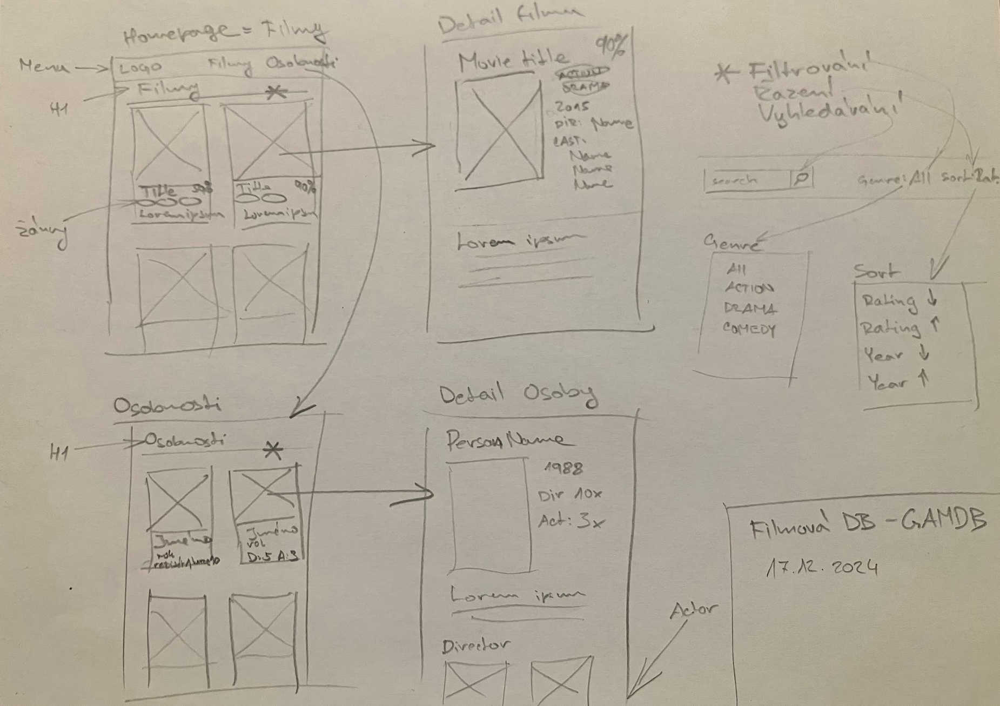

# Filmová databáze GAMDB

*Autor: Václav Chalupníček <vaclav.chalupnicek@gyarab.cz>*

Ukázkový ročníkový projekt z předmětu webové technologie ve šk. roce 2024/2025.

## Odborný článek

Filmová databáze je webová aplikace přístupná na <https://gamdb.lab.gyarab.cz>.

V administraci se spravuje databáze filmů, každý film má název, hodnocení, popis, rok premiéry, žánry a obrázek (plakát). Každý film má jednoho režiséra a několik herců.

Na homepage je seznam filmů, který je možné filtrovat (dle žánru) a řadit (dle hodnocení a roku). Seznam filmů tvoří kartičky, na kterých se zobrazuje titulní obrázek filmu, název, žánry a prvních 200 znaků popisu. Kliknutím na kartičku se zobrazí stránka detailu filmu, kde se zobrazují všechny atributy filmu. Z detailu filmu je možné prokliknout žánr (vede na HP s vyfiltrovaným žánrem) nebo režiséra či herce (vede do detailu osoby). Detail osoby zobrazuje Jméno, rok narození, fotografii a popis, dále jsou vylistované filmy, které daná osoba režírovala a ve kterých filmech hrála, přes ty je možné přejít do detailu filmu.

Hlavní menu obsahuje odkaz na homepage (seznam filmů) a odkaz na seznam osobností (osob). Oba seznamy mají v hlavičce nezávislé fulltext vyhledávání - po zadání výrazu se vypíší filmy/osobnosti, které mají hledaný výraz v názvu nebo popisu.

## Wireframes

